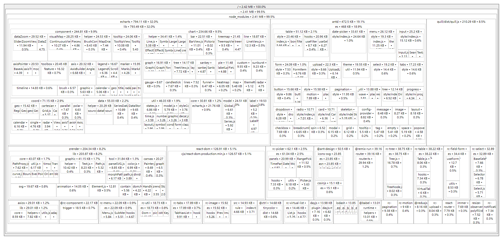
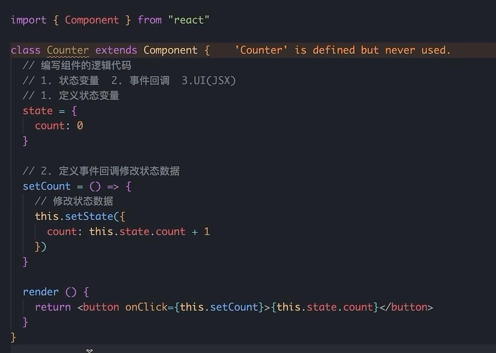
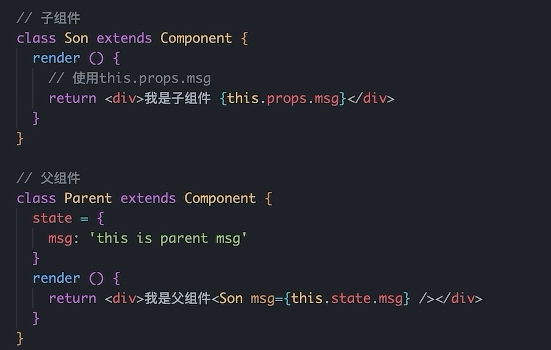
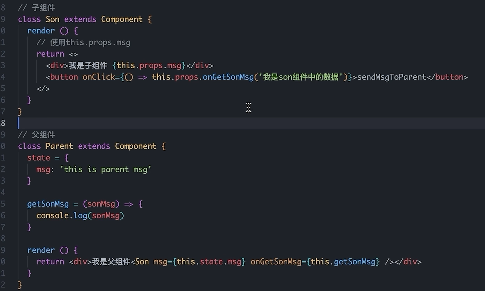

# React18学习

## 创建项目

1. 下载 node  yarn 等

   ```node
   npx create-react-app my-app
   npm init react-app my-app
   yarn create react-app my-app
   ```

   

## 语法

### 插值语法

`{}` 里面可以写变量

### useState 

#### 单项绑定（数据更改视图）

```js
import {useState} from 'react'
// 第一个参数是值，第二参数是更改方法
const [count,setCount] = useState(0)
setCount(2)

const [obj,setObj] = useState({name:'李四',age: 18})
setObj({
    ...obj,
    age: 19
})
```

#### 双向绑定

 input框，双向绑定

```
const [value, setValue] = useState('')
<input value={value} onChange={(e) => setValue(e.target.value)}/>
```

### useReducer

1. 定义一个reducer函数（根据不同的action返回不同的新状态）

   **type** 和 **payload** 一般是规范

   ```
   function reducer (state,action) {
   	// 根据不同的action type 返回不同的state
   	switch (action.type) {
   		case '1': 
   			return state + 1
   		case '2': 
   			return state + 2
   		case '3': 
   			return state + 3
   	}
   }
   ```

2. 在组件中调用useReducer，并传入reducer函数和状态的初始值

   ```
   const [state,dispatch] = useReducer(reducer, 0)
   ```

   

3. 时间发生时，通过dispatch函数分派一个action对象

   ```
   dispatch({type: '1'})
   ```


### useMemo

作用： 在组件每次重新渲染的时候缓存计算结果，类似vue的component

```
import {useMemo} from 'react'
// 第二个参数代表依赖，数组中的数据改了就会执行
useMemo(() => {
	// 返回计算得到的结果
},[])
```


### React.memo

作用： 允许组件在Props没有改变的情况下跳过渲染

React组件默认渲染机制，只要父组件重新渲染子组件就会重新渲染

```
import {memo} from 'react'
const MemoCompoent = memo(function App() {return <div></div>})
```


### useCallback

作用： 在组件多次重新渲染的时候缓存函数

```
import {useCallback} from 'react'
const changeHandler = useCallback((value) => console.log(value),[])
```


### forwardRef

作用：暴露的dom节点给父组件

```
// 子组件
const Input = forwardRef((props,ref) => {
	return <input type="text" ref={ref}>
})

// 父组件
function App() {
	const inputRef = useRef(null)
	return (
		<>
			<Input ref={inputRef}>
		</>
	)
}
```


### useImperativeHandle

作用： 暴露子组件里的方法，需要搭配forwardRef

```
// 子组件
const Input = forwardRef((props,ref) => {
	const inputRef = useRef();
	useImperativeHandle(ref, () => {
		return {inputRef}
	})
	return <input type="text" ref={inputRef}>
})

// 父组件
function App() {
	const inputRef = useRef(null)
	return (
		<>
			<Input ref={inputRef}>
		</>
	)
}
```


### dangerouslySetInnerHTML

作用：渲染html，类似v-html

```
<div dangerouslySetInnerHTML={{'<div></div>'}}>
</div>
```


### Class

用className绑定class

```
import './App.css'

<div className="name">
</div>
```


### 绑定方法

使用`onClick={fn}`

1. 不带参数

   ```
   const App = () => {
       const handleClick = (e) => {
           console.log('click test', e)
       }
       return (
       	<div onClick={handleClick}></div>
       )
   }
   ```

   

2. 带参数

   ```
   const App = () => {
       const handleClick = (name, e) => {
           console.log('click test', name, e)
       }
       return (
       	<div onClick={(e) => handleClick('张三',e)}></div>
       )
   }
   ```

### 获取Dom元素

1. 使用useRef获取

   ```
   const inputRef = useRef(null)
   ```

2. 使用 ref 绑定 dom元素

   ```
   <input ref={inputRef} />
   ```

3. 使用 **.current** 获取dom元素

   ```
   inputRef.current
   ```


### 父传子

#### props说明

+ 子组件只能读取props的数据，不能直接修改，父组件的数据只能由父组件修改

#### children

嵌套在 Son组件 里面的元素都是`props.children`

```
<Son>
	<span>children</span>
</Son>
```


### 子传父

在子组件里调用父组件传递的函数

1. 父组件绑定方法到子组件

   ```
   function App() {
     const fatherGetSonStr = (msg) => {
       console.log('我是父组件，子组件传递来的数据是:', msg)
     }
     return (
       <div>
         <Son getStr={fatherGetSonStr}>
         </Son>
       </div>
     )
   }
   ```

   

2. 子组件调用父组件的方法

   ```
   const Son = (props) => {
     console.log(props)
     const str = 'son msg'
     return (
       <div onClick={() => props.getStr(str)}>
         我是子组件
       </div>
     )
   }
   ```


### 兄弟组件通信

父组件定义数组，通过接收子组件1的数据，再转给子组件2

1. 父组件

   ```
   function App () {
     const [msg, setMsg] = useState('')
     const getMsg = (msg) => {
       setMsg(msg)
     }
     return (
       <div>
         <Son1 sendMsg={getMsg}></Son1>
         <Son2 msg={msg}></Son2>
       </div>
     )
   }
   ```

   

2. 子1传递数据给父组件

   ```
   const Son1 = (props) => {
     const msg = 'son1 msg'
     return (
       <div>
         我是Son1:
         <button onClick={() => props.sendMsg(msg)}>传递Son1 msg</button>
         {props.msg}
       </div>
     )
   }
   ```

   

3. 子2接收数据

   ```
   const Son2 = (props) => {
     return (
       <div>
         我是Son2:
         {props.msg}
       </div>
     )
   }
   ```

   

### Context机制跨层级组件通信

1. 使用`createContext`方法创建一个上下文对象Ctx

   ```
   const MsgCtx = createContext()
   ```

   

2. 在顶层组件使用 `Ctx.provider组件`提供数据

   ```
   function App () {
     const msg = 'app msg'
     return (
       <div>
         <MsgCtx.Provider value={msg}>
           <Son1></Son1>
         </MsgCtx.Provider>
       </div>
     )
   }
   ```

   

3. 底层使用 `useContext` 获取数据

   ```
   const Son2 = (props) => {
     const msg = useContext(MsgCtx)
     return (
       <div>
         我是Son2:{msg}
       </div>
     )
   }
   ```

   

### useEffect

`useEffect`是一个 React Hook 函数，用于在React组件中创建不是由事件引起而是**渲染本身引起的操作**，比如Vue生命周期。

```
// 参数1是要执行的操作，参数2是依赖项
useEffect(() => {}, [])
```

第二个参数的三种情况：

1. 没有依赖项： 初始 + 组件更新
2. 空依赖项： 初始
3. 有依赖项：初始 + 依赖项更新

当触发以上情况就会执行参数一的回调方法


#### 使用方法：

```
const delay = (time) => {
  return new Promise((r) => {
    setTimeout(() => {
      console.log('完成')
      r()
    }, time)
  })
}

function App () {
  useEffect(() => {
    delay(2000)
  }, []);
  return (
    <div>
    </div>
  )
}
```

#### 清除副作用（就是清除useEffect)

+ 使用方法

```
useEffect(() =>{
	//  副作用逻辑
	//  .....
	return () => {
		// 清除副作用逻辑,组件卸载时执行
		// ...
	}
})
```

+ 例子

```
const Son = () => {
  useEffect(() => {
    const timer = setInterval(() => {
      requestAnimationFrame(() => {
        console.log('定时器在执行')
      })
    }, 0)
    return () => {
      clearInterval(timer)
    }
  })
  return (
    <div>son组件</div>
  )
}

function App () {
  const [bool, setBool] = useState(true)
  return (
    <div>
      <button onClick={() => setBool(!bool)}>toggle</button>
      <hr></hr>
      {bool && <Son></Son>}
    </div>
  )
}
```


**注意**：严格模式下会执行两次，就是 **index.js**文件下的`React.StrictMode`组件

```
root.render(
  // <React.StrictMode>
    <App />
  // </React.StrictMode>
);

```


### 自定义Hook

概念： 自定义hook 一般以 **use开头的函数**，实现逻辑的封装和复用

+ 注意事项
  1. 只能在组件或者其他Hook中使用
  2. 只能在组件顶层调用，不能嵌套在if for等其他函数中

##### 封装之前

```
function App () {
  const [bool, setBool] = useState(true)
  const toggle = () => {
    setBool(!bool)
  }
  return (
    <div>
      <button onClick={toggle}>toggle</button>
      <hr></hr>
      {bool && <Son></Son>}
    </div>
  )
}
```


##### 封装后

```
const useToggleSon = () => {
  const [bool, setBool] = useState(true)
  const toggle = () => {
    setBool(!bool)
  }
  return {
    bool,
    toggle
  }
}

function App () {
  const { bool, toggle } = useToggleSon()
  return (
    <div>
      <button onClick={toggle}>toggle</button>
      <hr></hr>
      {bool && <Son></Son>}
    </div>
  )
}
```

## Redux

+ 插件安装

  1. Redux Toolkit：简化redux书写方式
  2. react-redux：连接react redux的中间件

  `yarn add @reduxjs/toolkit react-redux`

#### 在html文件使用 redux

1. 定义一个 `reducer` 函数

   ```
   function reducer = (state = {count:0}, action) {
   	if(action === 'INCREMENT') {
   		return {count: count +1}
   	} else if (action === 'DECREMENT') {
   		return {count: count - 1}
   	}
   	return state
   }
   ```

   

2. 通过`Redux.createStore`使用 `reducer` 函数生成`store`实例

   ```
   const store = Redux.createStore(reducer
   ```

   

3. 通过`store`实例的`subscribe`订阅数据变化

   ```
   store.subscribe(() => {
   	console.log('state更改了'，store.getState())
   })
   ```

   

4. 通过`store`实例的`dispatch`函数提交action更改状态

   ```
   store.dispatch({
    type: 'INCREMENT'
   })
   ```

   

5. 通过 `store`实例的`getState`方法获取最新状态

   ```
   store.getState()
   ```

   

#### 在 react 中使用

1. 使用 React Toolkit创建 store

   ```
   import { createSlice } from '@reduxjs/toolkit'
   
   const countStore = createSlice({
     name: 'count',
     initialState: {
       count: 0
     },
     reducers: {
       increment (state) {
         state.count++
       },
       decrement (state) {
         state.count--
       }
     }
   })
   
   const { increment, decrement } = countStore.actions
   
   const reducer = countStore.reducer
   
   export { increment, decrement }
   export default reducer
   ```

   

2. store/index/js文件导出

   ```
   import { configureStore } from "@reduxjs/toolkit";
   import countReducer from './modules/countStore'
   const store = configureStore({
     reducer: {
       count: countReducer
     }
   })
   
   export default store
   ```

   

3. 绑定到index.js文件

   ```
   import store from './store'
   import { Provider } from 'react-redux';
   root.render(
     <React.StrictMode>
       <Provider store={store}>
         <App />
       </Provider>
     </React.StrictMode>
   );
   ```

   

4. 组件中使用

   + 获取，使用 `useSelector`方法

     ```
     import { useSelector } from "react-redux";
     
     const { count } = useSelector(state => state.count)
     ```

   + 修改数据，使用useDispatch

     + 不传参

       ```
       import { useSelector, useDispatch } from "react-redux";
       import { increment, decrement } from './store/modules/countStore'
       
       function App () {
         const { count } = useSelector(state => state.count)
         const dispatch = useDispatch()
         return (
           <div>
             <button onClick={() => dispatch(decrement())}>-</button>
             {count}
             <button onClick={() => dispatch(increment())}>+</button>
           </div>
         );
       }
       ```

       

     + 传参，在定义的时候使用`.payload`接收

       ```
       const countStore = createSlice({
         name: 'count',
         initialState: {
           count: 0
         },
         reducers: {
           incrementNum (state, action) {
             state.count += action.payload
           }
         }
       })
       ```

       

     + 异步操作，在定义的时候，单独定义一个方法使用dispatch修改store

       + 定义

         ```
         import { createSlice } from "@reduxjs/toolkit";
         import axios from 'axios'
         
         const channelStore = createSlice({
           name: 'channel',
           initialState: {
             channelList: []
           },
           reducers: {
             setChannel (state, action) {
               state.channelList = action.payload
             }
           }
         })
         
         const { setChannel } = channelStore.actions
         
         const fetchGetChannel = () => {
           return async (dispatch) => {
             const { data: res } = await axios.get('http://geek.itheima.net/v1_0/channels')
             dispatch(setChannel(res.data.channels))
           }
         }
         
         export { fetchGetChannel }
         
         const reducer = channelStore.reducer
         
         export default reducer
         ```

         

       + 调用

         ```
         import { fetchGetChannel } from "./store/modules/channelStore";
         const { channelList } = useSelector(state => state.channel)
         useEffect(() => {
         	dispatch(fetchGetChannel())
         }, [])
         <ul>
         	{channelList.map(item => (<li>{item.name}</li>))}
         </ul>
         ```

         

       

   ##### 总结

   使用 `useSelector` 获取store数据

   使用 `useDispatch` 获取dispatch方法

   引入 `action` 对象然后用 `useDispatch` 修改数据 


## React Router

### 初始化配置

1. 安装

   `yarn add react-router-dom`

2. 使用

   + router/index.js

     ```
     import { createBrowserRouter } from 'react-router-dom'
     
     import Login from '../page/Login'
     import Article from '../page/Article'
     const router = createBrowserRouter([
       {
         path: '/login',
         element: <Login/>
       },
       {
         path: '/article',
         element: <Article/>
       }
     ])
     
     export default router
     ```

     

   + index.js

     ```
     import { RouterProvider } from 'react-router-dom';
     
     const root = ReactDOM.createRoot(document.getElementById('root'));
     root.render(
       <RouterProvider router={router}>
       </RouterProvider>
     );
     
     ```

     


### 路由懒加载

1. 使用react提供的`lazy`函数，异步引入组件
2. 使用 `Suspense` 组件渲染异步组件，使用fallback在组件渲染之前显示的效果

```
import { createBrowserRouter } from 'react-router-dom'

import { lazy, Suspense } from 'react'
const Login = lazy(() => import('../page/Login'))
const Article = lazy(() => import('../page/Article'))
const router = createBrowserRouter([
  {
    path: '/login',
    element: <Suspense fallback={'加载中'}><Login /></Suspense>
  },
  {
    path: '/article',
    element: <Suspense fallback={'加载中'}><Article /></Suspense>
  }
])

export default router
```


### 路由导航

#### 声明式导航

使用 `link` 标签

```
import { Link } from 'react-router-dom'
<Link to='/article'>跳转到文章页</Link>
```

#### 编程式导航

使用  `useNavigate` 钩子获取导航方法

```
import { useNavigate } from 'react-router-dom'
const navigate = useNavigate()
<button onClick={() => navigate('/login')}>跳转登录页</button>
```

#### 传参

1. searchParams传参

   ```
   // 传参
   navigate('/login?userName=zs&age=18')
   
   // 接收参数
   import { useSearchParams } from 'react-router-dom'
   const [params] = useSearchParams()
   const userName = params.get('userName')
   ```

2. params传参

   ```
   // 传参
   navigate('/login/1001')
   
   // 路由修改需要path
   {
       path: '/login/:id',
       element: <Login />
   },
    
   // 接收
   import { useParams } from 'react-router-dom'
   const params = useParams()
   params.id
   ```

   

#### 嵌套路由配置

routes使用`children`

```
{
    path: '/article',
    element: <Article />,
    children: [
      {
        path: '/article/son1',
        element: <ArticleSon></ArticleSon>
      }
    ]
  }
```


父组件用 `Outlet`组件渲染

```
<Outlet></Outlet>
```

##### 默认路由

去掉**children下的path**，使用**index**，可以当路由为父组件的**path**时，默认渲染子路由

```
{
    path: '/article',
    element: <Article />,
    children: [
      {
        index: true,
        element: <ArticleSon1></ArticleSon1>
      },
      {
        path: '/article/son2',
        element: <ArticleSon2></ArticleSon2>
      }
    ]
}
```

默认会显示`Article`和`ArticleSon1`

##### 404路由

在routes末尾使用`*`来

```
{
    path: '*',
    element: <NotFound />
}
```


##### Router两种路由模式设置

history 和 hash 模式

分别使用 `createBrowserRouter` 和 `createHashRouter` 创建router实例


## 优化

### 路由懒加载

``` 
import { lazy, Suspense } from 'react'
const AuthRoute = lazy(() => import('@/components/AuthRoute'))
const Layout = lazy(() => import('@/pages/Layout/Layout.js'))
const Login = lazy(() => import('@/pages/Login/Login'))
const Home = lazy(() => import('@/pages/Home/Home.js'))
const Article = lazy(() => import('@/pages/Article/Article.js'))
const Publish = lazy(() => import('@/pages/Publish/Publish.js'))

const routes = [
  {
    path: '/',
    element: <Suspense fallback={'加载中'}><AuthRoute><Layout /></AuthRoute></Suspense>,
    children: [
      {
        index: true,
        element: <Suspense fallback={'加载中'}><Home /></Suspense>
      },
      {
        path: 'article',
        element: <Suspense fallback={'加载中'}><Article /></Suspense>
      },
      {
        path: 'publish',
        element: <Suspense fallback={'加载中'}><Publish /></Suspense>
      },
    ]
  },
  {
    path: '/login',
    element: <Suspense><Login /></Suspense>
  }
]
export default routes
```


### 打包优化

#### `source-map-explorer` 查看包体积

1. 安装包

   `yarn add source-map-explorer` 

2. 配置命令

   ```
   "scripts": {
       "analyze": "source-map-explorer 'build/static/js/*'"
   },
   ```

3. 执行命令及效果

   `yarn run analyze`

   

#### CDN优化

1. 打包时排除 插件
2. 使用CDN引入插件


 + cacro.config.js

   ```
   // 扩展webpack的配置
   
   const path = require('path')
   // 引入辅助函数
   const { whenProd, getPlugin, pluginByName } = require('@craco/craco')
   
   module.exports = {
   	// webpack 配置
   	webpack: {
   		// 配置别名
   		alias: {
   			// 约定：使用 @ 表示 src 文件所在路径
   			'@': path.resolve(__dirname, 'src')
   		},
   		// 配置CDN
   		configure: (webpackConfig) => {
   			let cdn = {
   				js: []
   			}
   			whenProd(() => {
   				// key: 不参与打包的包(由dependencies依赖项中的key决定)
   				// value: cdn文件中 挂载于全局的变量名称 为了替换之前在开发环境下
   				webpackConfig.externals = {
   					react: 'React',
   					'react-dom': 'ReactDOM'
   				}
   				// 配置现成的cdn资源地址
   				// 实际开发的时候 用公司自己花钱买的cdn服务器
   				cdn = {
   					js: [
   						'https://cdnjs.cloudflare.com/ajax/libs/react/18.1.0/umd/react.production.min.js',
   						'https://cdnjs.cloudflare.com/ajax/libs/react-dom/18.1.0/umd/react-dom.production.min.js',
   					]
   				}
   			})
   			// 通过 htmlWebpackPlugin插件 在public/index.html注入cdn资源url
   			const { isFound, match } = getPlugin(
   				webpackConfig,
   				pluginByName('HtmlWebpackPlugin')
   			)
   			if (isFound) {
   				// 找到了HtmlWebpackPlugin的插件
   				match.options.cdn = cdn
   			}
   			return webpackConfig
   		}
   	},
   }
   ```

   

 + public/index.html

   ```
   <!-- 动态插入cdn -->
   <% htmlWebpackPlugin.options.cdn.js.forEach(cdnURL=> { %>
       <script src="<%= cdnURL %>"></script>
   <% }) %>
   ```

   


## 工具

### classnames优化类名控制

​	网址：[https://www.npmjs.com/package/classnames](https://www.npmjs.com/package/classnames)

1. 下载

   ```
   npm install classnames
   ```

2. 导入

   ```
   const classNames = require('classnames')
   ```

   或者

   ```
   import classNames from 'classnames'
   ```

3. 使用

   ```
   classNames('foo', { bar: true }); // => 'foo bar'
   ```


### uuid生成唯一随机数

网址：[https://github.com/uuidjs/uuid](https://github.com/uuidjs/uuid)

1. 下载

   ```
   npm install uuid
   ```

2. 导入

   ```
   import { v4 as uuidv4 } from 'uuid';
   ```

3. 使用

   ```
   uuidv4()
   ```

   

### craco

1. 下载

   `npm i -D @craco/craco`

2. 在根目录创建文件

   craco.config.json

3. 配置文件添加路径解析配置

   ```
   const path = require('path')
   module.exports = {
   	webpack:{
   		alias:{
   			'@': path.resolve(__dirname, 'src')
   		}
   	}
   }
   ```

   

4. 包文件中配置启动和打包命令

   ```
   "start": "react-scripts start",
   "build": "react-scripts build",
   // 更改为
   "start": "craco start",
   "build": "craco build",
   ```

+ vscode 联想路径配置

  1. 根目录新增 `jsconfig.json` 文件

  2. 添加路径配置

     ```
     {
       "compilerOptions": {
         "baseUrl": "./",
           "paths": {
           "@/*": [
             "src/*"
           ]
         }
       }
     }
     ```

  


### json-server 实现数据 Mock

1. 项目中安装json-server

   `yarn add json-server`

2. 准备一个json文件

   **server/data.json**

   ```
   {
     "data": [
       {
         "id": "1",
         "name": "張三"
       },
       {
         "id": "2",
         "name": "李四"
       }
     ]
   }
   ```

   

3. 添加启动命令

   ```
   "server": "json-server ./server/data.json --port 8888"
   ```

4. 访问接口进行测试

### 初始化样式的三方库

`Normalize.css`


  ### 富文本编辑器

  `react-quill`
  react18需要使用特定版本react-quill@2.0.0-beta.2


  ### 本地预览

  `serve`

    1. 安装

    `yarn add serve`

    2. 运行

    `serve -s build`


## Class Api（旧版不推荐）

#### 基础模板




### 父传子




### 子传父



### 生命周期

1. componentDisMount（组件渲染完毕）
2. componentWillUnmount（组件卸载）


## zustand（Redux替代品）

1. 安装

   `yarn add zustand`

2. 使用

   ```
   import {create} from 'zustand'
   
   // 创建store
   const useStore = create((set) =>{
   	return {
   		// 定义状态数据
   		count: 0,
   		// 修改状态数据方法
   		inc: () => {
   			// 需要原数据
   			set((state)=> ({count: state.count + 1}))
   			// 不需要数据，直接修改
   			set({count:100})
   		}
   	}
   })
   
   // 绑定store
   function App () {
   const { count, inc } = useStore()
       return (
       	<>
       		this is app
       		<button onClick={inc}>{count}</button>
       	</>
       )
   }
   ```

注意： 

+ 函数必须返回一个对象，存放数据和方法
+ 参数set是用来修改数据的方法


#### 切片模式

+ count切片

  ```
  const createCountStore = ((set) =>{
  	return {
  		// 定义状态数据
  		count: 0,
  		// 修改状态数据方法
  		inc: () => {
  			// 需要原数据
  			set((state)=> ({count: state.count + 1}))
  			// 不需要数据，直接修改
  			set({count:100})
  		}
  	}
  })
  ```

  

+ channel切片

  ```
  const createChannelStore = ((set) =>{
  	return {
  		// 定义状态数据
  		channel: [],
  		// 修改状态数据方法
  		setChannel: () => {
  			set({channel:[1,2,3]})
  		}
  	}
  })
  ```

  

+ 组合切片

  ```
  const useStore = create((...a) => {
  	return {
  		...createCountStore(...a),
  		...createChannelStore(...a)
  	}
  })
  ```

  